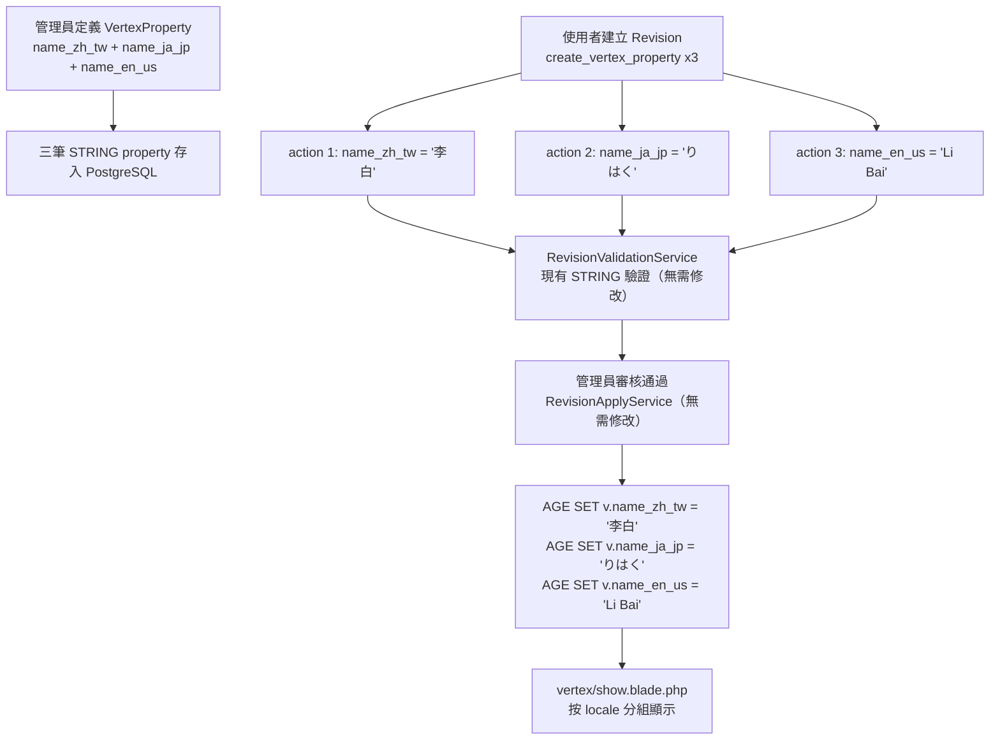

# 多語系 Property 值設計方案（方案 A：Suffix Property）

## 核心概念

在現有架構下，以 **一個語言版本 = 一筆 `VertexProperty`** 的方式實現多語系。

例如「人物」VertexType 要支援中英日文姓名：

| age_property_name | name | locale  | age_property_type |
| ----------------- | ---- | ------- | ----------------- |
| `name_zh_tw`      | 姓名   | `zh_tw` | STRING            |
| `name_ja_jp`      | 名前   | `ja_jp` | STRING            |
| `name_en_us`      | Name | `en_us` | STRING            |
| `birth_year`      | 出生年份 | null    | INTEGER           |

AGE 中儲存為**各自獨立的純量欄位**：

```
v.name_zh_tw = '李白'
v.name_ja_jp = 'りはく'
v.name_en_us = 'Li Bai'
v.birth_year = 701
```

---

## 範圍外：Vertex 顯示名稱

`VertexType.show_property_name` 如何搭配多語系 property 顯示（列表標題、詳情頁 h1 等）**不在本文件範圍**，另見 [`show-property-name.md`](./show-property-name.md)。建議先完成本文件，再實作顯示名稱解析。

---

## 最大優勢：Revision 流程零改動

方案 A 對以下層完全**不需修改**：

- `PropertyType` enum（localized properties 皆為 `STRING`）
- `RevisionValidationService`（STRING 驗證已可用）
- `RevisionApplyService`（STRING SET 已可用）
- `revision_actions` 資料表結構

---

## 設計細節

### 1. 支援語言設定

在 `config/cohistograph/app.php` 新增：

```php
'graph' => [
    // 現有 connection-name, name...
    'locales' => [
        'zh_tw' => '繁體中文',
        'ja_jp' => '日本語',
        'en_us' => 'English',
    ],
],
```

---

### 2. Schema 層（Migration）

新增 migration，在兩張表加入 `locale` 欄位：

```php
// vertex_properties 與 edge_properties
$table->string('locale')->nullable();
```

- `null`：非多語系 property（現有行為不變）
- `'zh_tw'` / `'en_us'`…：表示此 property 儲存特定語言的值，格式強制為 `xx_xx`

---

### 3. 命名慣例

當 `locale` 不為 null 時，`age_property_name` 應以 `_{locale}` 結尾，格式強制為 `xx_xx`（兩個小寫英文字母組，以底線分隔）：

- locale = `zh_tw` → `age_property_name = 'name_zh_tw'`
- locale = `en_us` → `age_property_name = 'name_en_us'`

此格式由 Form Request 的 `regex:/^[a-z]{2}_[a-z]{2}$/` 驗證強制執行，config 中的 locale key 也必須符合此格式。

---

### 4. Schema 管理 UI（Auto-append 行為）

`resources/views/graph-schema/vertex-property/create-or-edit.blade.php` 的表單行為：

- **locale = null（預設）**：`age_property_name` 欄位維持現有行為，使用者直接輸入完整名稱。
- **locale 選擇 `zh_tw`**：`age_property_name` 欄位改為輸入「基底名稱（base name）」，表單即時顯示預覽：

```
語言版本：[ 繁體中文（zh_tw） ▾ ]

AGE 屬性基底名稱：[ name              ]
                  → 將儲存為 name_zh_tw
```

Controller 在 `store` / `update` 時，若 `locale` 不為 null，則自動將 `age_property_name` 設為 `{base_name}_{locale}`，不讓使用者手動輸入後綴。

> **衝突保護**：現有的 `[vertex_type_id, age_property_name]` unique constraint 已可防止重複，但 Form Request 應在送進 DB 前**提前驗證**生成後的完整名稱是否已存在，並提供清楚的錯誤訊息（如「name_zh_tw 已被使用」），而非讓 DB 拋出 constraint 例外。

> **locale 互斥規則**：同一 VertexType 下，同一個 base name 只能選擇「全部 localized」或「全部 non-localized」，不可混用：
>
> - 建立 **locale=null** 的 `name` 時：若已存在任何 `locale != null` 且 `age_property_name` 以 `name_` 開頭的 property（如 `name_zh_tw`），則**禁止建立**，回傳錯誤「已存在多語系版本的同名屬性，無法建立非多語系版本」
> - 建立 **locale=zh_tw** 的 base=`name` 時：若已存在 `locale=null` 且 `age_property_name = name` 的 property，則**禁止建立**，回傳錯誤「已存在非多語系版本的同名屬性，無法建立多語系版本」

---

### 5. Form Request 驗證

Form Request 接收 `base_age_property_name`（locale 不為 null 時）或 `age_property_name`（locale 為 null 時），Controller 在驗證後拼接：

```php
// StoreVertexPropertyRequest
'locale'                 => ['nullable', 'string', 'regex:/^[a-z]{2}_[a-z]{2}$/', Rule::in(array_keys(config('cohistograph.app.graph.locales')))],
'base_age_property_name' => ['required_with:locale', 'string', new AgePropertyName],
'age_property_name'      => ['required_without:locale', 'string', new AgePropertyName],
```

> **`UpdateVertexPropertyRequest` 限制**：`locale` 欄位建立後**不允許變更**。若允許改動，`age_property_name` 也需連動變更，而 AGE 中已有舊 property key 的資料無法自動遷移，會造成資料不一致。Update 時 `locale` 應為唯讀，表單不顯示該欄位（或 disabled）。

Controller 中組合：

```php
$agePropertyName = $validated['locale']
    ? $validated['base_age_property_name'] . '_' . $validated['locale']
    : $validated['age_property_name'];
```

`age_property_name` 在資料庫中仍儲存完整名稱（如 `name_zh_tw`），不另外存 base name。

---

### 6. Revision 表單（Vue）

`resources/js/Pages/Revisions/Partials/VertexPropertyActionForm.vue` 的 property 下拉選項加上 locale 標籤：

```
人物 / 姓名（繁體中文） [zh_tw] (name_zh_tw)
人物 / 名前（日本語）   [ja_jp] (name_ja_jp)
人物 / Name (English)   [en_us] (name_en_us)
```

無需改動選取後的值儲存邏輯（依然是純 STRING value）。

---

### 7. 顯示層（Vertex 詳情頁）

`resources/views/graph/vertex/show.blade.php` 讀取 vertex properties 時，依據 `VertexProperty.locale` 將同一概念的不同語言版本分組顯示：

```
姓名
  繁體中文：李白
  日本語：りはく
  English (US)：Li Bai

出生年份：701
```

分組邏輯：stripping `_{locale}` 後綴（即末尾的 5 字元 `_xx_xx`）後，相同 base name 的 properties 歸為一組。例如 `name_zh_tw`、`name_ja_jp`、`name_en_us` 都還原為 `name` 後分在同一組。`VertexType::properties()` 已有 eager load，所以只需在 Blade 層整理分組。

**locale=null 與 locale 不為 null 並存時的顯示規則：**

由於 Form Request 驗證強制互斥（同一 base name 不允許同時有 null 與非 null 版本），此情境在正常流程下不會發生，顯示層無需處理 fallback 邏輯。

---

## 架構流程圖



---

## 需修改的檔案摘要

- `config/cohistograph/app.php` — 新增 `locales` 設定
- `database/migrations/xxxx_add_locale_to_property_tables.php`（新建） — 新增 `locale` 欄位
- `app/Models/VertexProperty.php` — `fillable` 加入 `locale`
- `app/Models/EdgeProperty.php` — `fillable` 加入 `locale`
- `app/Http/Requests/GraphSchema/StoreVertexPropertyRequest.php` — 新增 `locale` / `base_age_property_name` 驗證規則
- `app/Http/Requests/GraphSchema/UpdateVertexPropertyRequest.php` — `locale` 設為不可更新
- `app/Http/Requests/GraphSchema/StoreEdgePropertyRequest.php` — 新增 `locale` / `base_age_property_name` 驗證規則
- `app/Http/Requests/GraphSchema/UpdateEdgePropertyRequest.php` — `locale` 設為不可更新
- `app/Http/Controllers/GraphSchema/VertexPropertyController.php` — `store` / `update` 拼接 `age_property_name`；互斥規則驗證
- `app/Http/Controllers/GraphSchema/EdgePropertyController.php` — 同上
- `resources/views/graph-schema/vertex-property/create-or-edit.blade.php` — 加入 locale 選擇器與 base name 預覽
- `resources/views/graph-schema/vertex-property/show.blade.php` — 顯示 `locale` 欄位
- `resources/views/graph-schema/edge-property/create-or-edit.blade.php` — 加入 locale 選擇器與 base name 預覽
- `resources/views/graph-schema/edge-property/show.blade.php` — 顯示 `locale` 欄位
- `resources/js/Pages/Revisions/Partials/VertexPropertyActionForm.vue` — property 選項顯示 locale 標籤
- `resources/js/Pages/Revisions/Partials/EdgePropertyActionForm.vue` — property 選項顯示 locale 標籤
- `resources/views/graph/vertex/show.blade.php` — 按 locale 分組顯示
- `database/factories/VertexPropertyFactory.php` — `locale` 預設 `null`
- `database/factories/EdgePropertyFactory.php` — `locale` 預設 `null`
- 對應的 test 檔案（`VertexPropertyTest.php`、`EdgePropertyTest.php`）
