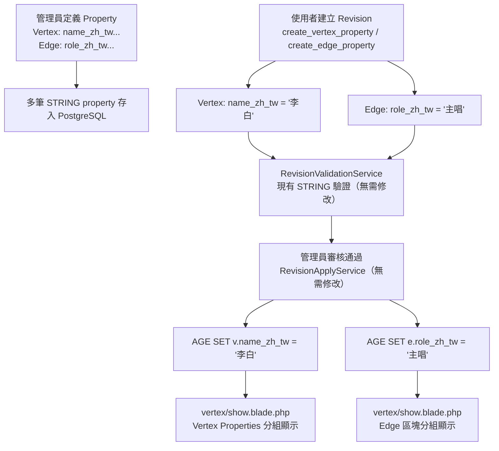

# 多語系 Property 值設計方案（方案 A：Suffix Property）

## 核心概念

在現有架構下，以 **一個語言版本 = 一筆 Property 定義（`VertexProperty` 或 `EdgeProperty`）** 的方式實現多語系。Vertex 與 Edge 採用相同規則，以下以 Vertex 為例說明；Edge 範例見 §7.2。

例如「人物」VertexType 要支援中英日文姓名：

| age_property_name | name | locale  | age_property_type |
| ----------------- | ---- | ------- | ----------------- |
| `name_zh_tw`      | 姓名   | `zh_tw` | STRING            |
| `name_ja_jp`      | 名前   | `ja_jp` | STRING            |
| `name_en_us`      | Name | `en_us` | STRING            |
| `birth_year`      | 出生年份 | null    | INTEGER           |

AGE 中儲存為**各自獨立的純量欄位**：

```
v.name_zh_tw = '李白'
v.name_ja_jp = 'りはく'
v.name_en_us = 'Li Bai'
v.birth_year = 701
```

---

## 範圍外：Vertex 顯示名稱

`VertexType.show_property_name` 如何搭配多語系 property 顯示（列表標題、詳情頁 h1 等）**不在本文件範圍**，另見 [`show-property-name.md`](./show-property-name.md)。建議先完成本文件，再實作顯示名稱解析。

---

## 最大優勢：Revision 流程零改動

方案 A 對以下層完全**不需修改**：

- `PropertyType` enum（localized properties 皆為 `STRING`）
- `RevisionValidationService`（STRING 驗證已可用）
- `RevisionApplyService`（STRING SET 已可用）
- `revision_actions` 資料表結構

---

## 設計細節

### 1. 支援語言設定

在 `config/cohistograph/app.php` 新增：

```php
'graph' => [
    // 現有 connection-name, name...
    'locales' => [
        'zh_tw' => '繁體中文',
        'ja_jp' => '日本語',
        'en_us' => 'English',
    ],
],
```

---

### 2. Schema 層（Migration）

新增 migration，在兩張表加入 `locale` 欄位：

```php
// vertex_properties 與 edge_properties
$table->string('locale')->nullable();
```

- `null`：非多語系 property（現有行為不變）
- `'zh_tw'` / `'en_us'`…：表示此 property 儲存特定語言的值，格式強制為 `xx_xx`

---

### 3. 命名慣例

當 `locale` 不為 null 時，`age_property_name` 應以 `_{locale}` 結尾，格式強制為 `xx_xx`（兩個小寫英文字母組，以底線分隔）：

- locale = `zh_tw` → `age_property_name = 'name_zh_tw'`
- locale = `en_us` → `age_property_name = 'name_en_us'`

此格式由 Form Request 的 `regex:/^[a-z]{2}_[a-z]{2}$/` 驗證強制執行，config 中的 locale key 也必須符合此格式。

> **`xx_xx` 格式為刻意設計**，不採用 BCP 47（如 `zh-Hant`、`en`）。未來若需擴充格式，須同步修改 migration、regex 與 config key。

> **長度限制**：現有 `AgePropertyName` 規則上限為 64 字元，且套用於拼接後的**完整** `age_property_name`。locale 固定 5 字元（如 `zh_tw`），因此 `base_age_property_name` 最長為 **58 字元**（64 - 1 底線 - 5 locale）。Form Request 驗證 `base_age_property_name` 時須加上 `'max:58'` 規則——單靠 `AgePropertyName` 只能確保名稱格式合法，無法保證拼接後不超過 64 字元。

---

### 4. Schema 管理 UI（Auto-append 行為）

Vertex 與 Edge 的 property 表單行為相同，分別實作於：

- `resources/views/graph-schema/vertex-property/create-or-edit.blade.php`
- `resources/views/graph-schema/edge-property/create-or-edit.blade.php`

表單行為：

- **locale = null（預設）**：`age_property_name` 欄位維持現有行為，使用者直接輸入完整名稱。
- **locale 選擇 `zh_tw`**：`age_property_name` 欄位改為輸入「基底名稱（base name）」，表單即時顯示預覽：

```
語言版本：[ 繁體中文（zh_tw） ▾ ]

AGE 屬性基底名稱：[ name              ]
                  → 將儲存為 name_zh_tw
```

Controller 在 `store` / `update` 時，若 `locale` 不為 null，則自動將 `age_property_name` 設為 `{base_name}_{locale}`，不讓使用者手動輸入後綴。

> **衝突保護**：現有的 `[vertex_type_id, age_property_name]` / `[edge_type_id, age_property_name]` unique constraint 已可防止重複，但 Form Request 應在送進 DB 前**提前驗證**生成後的完整名稱是否已存在，並提供清楚的錯誤訊息（如「name_zh_tw 已被使用」），而非讓 DB 拋出 constraint 例外。

> **locale 互斥規則**：同一 VertexType / EdgeType 下，同一個 base name 只能選擇「全部 localized」或「全部 non-localized」，不可混用。比對方式為 **base name 精確比對**（`age_property_name = base` 或 `age_property_name = {base}_{locale}`），不用 `starts with "{base}_"`：
>
> - 建立 **locale=null** 的 `name` 時：若已存在任何 `locale != null` 且 `age_property_name = name_{locale}` 的 property（如 `name_zh_tw`），則**禁止建立**，回傳錯誤「已存在多語系版本的同名屬性，無法建立非多語系版本」
> - 建立 **locale=zh_tw** 的 base=`name` 時：若已存在 `locale=null` 且 `age_property_name = name` 的 property，則**禁止建立**，回傳錯誤「已存在非多語系版本的同名屬性，無法建立多語系版本」

---

### 5. Form Request 驗證

`StoreVertexPropertyRequest` / `StoreEdgePropertyRequest` 接收 `base_age_property_name`（locale 不為 null 時）或 `age_property_name`（locale 為 null 時），Controller 在驗證後拼接：

```php
// StoreVertexPropertyRequest
'locale'                 => ['nullable', 'string', 'regex:/^[a-z]{2}_[a-z]{2}$/', Rule::in(array_keys(config('cohistograph.app.graph.locales')))],
'base_age_property_name' => ['required_with:locale', 'string', 'max:58', new AgePropertyName],
'age_property_name'      => ['required_without:locale', 'string', new AgePropertyName],
```

> **`locale` 空值語意**：「非多語系」統一以 `null` 或省略欄位表示。前端不得送空字串 `""`（`nullable` 規則不會將其轉為 `null`，會導致 `Rule::in` 驗證失敗）。

> **`UpdateVertexPropertyRequest` / `UpdateEdgePropertyRequest` 限制**：`locale` 與 `age_property_name`（含 base name）建立後**皆不允許變更**。若允許改動，AGE 中已有舊 property key 的資料無法自動遷移，會造成資料不一致。Update 時兩者皆應為唯讀，表單不顯示（或 disabled）。

> **`age_property_type` 不強制為 `STRING`**：localized properties 慣例上皆為 `STRING`（有語言差異的欄位幾乎必然是文字），但驗證層不強制此規則，維持實作簡單。

> **`locale` 與後綴一致性**：Controller 是唯一寫入入口，不在 Model 層或額外 Rule class 強制 `locale` 與 `age_property_name` 後綴一致。

> **Form Request 重構**：現有 `VertexPropertyController` / `EdgePropertyController` 採 inline `$this->validate()`，本次實作須抽出獨立 Form Request class（見需修改的檔案摘要）。互斥規則抽為共用 Rule class `app/Rules/GraphSchema/LocaleMutualExclusion.php`，供 Vertex 與 Edge Store Request 共用。

Controller 中組合：

```php
$agePropertyName = $validated['locale']
    ? $validated['base_age_property_name'] . '_' . $validated['locale']
    : $validated['age_property_name'];
```

`age_property_name` 在資料庫中仍儲存完整名稱（如 `name_zh_tw`），不另外存 base name。

---

### 6. Revision 表單（Vue）

`VertexPropertyActionForm.vue` 與 `EdgePropertyActionForm.vue` 的 property 下拉選項加上 locale 標籤：

```
人物 / 姓名（繁體中文） [zh_tw] (name_zh_tw)
人物 / 名前（日本語）   [ja_jp] (name_ja_jp)
人物 / Name (English)   [en_us] (name_en_us)
```

無需改動選取後的值儲存邏輯（依然是純 STRING value）。

> **前端 locale 顯示名稱（如「繁體中文」badge）暫緩**：待後端實作完成後一併規劃資料來源（config 直接傳 vs API props）。

---

### 7. 顯示層

#### 7.0 共用分組邏輯

Vertex 與 Edge 的 property **值**顯示共用同一套分組演算法，抽出為 `App\Support\LocalizedPropertyGrouper`（或等效 helper），避免 Blade / Controller 重複實作。

**輸入：** property 定義集合（`VertexProperty` / `EdgeProperty`，含 `locale`、`age_property_name`、`name`）與 AGE 回傳的 `properties` 鍵值對。

**分組規則（以 `locale` 欄位為主，不用 blind suffix strip）：**

| `locale` | 歸組方式 |
|----------|----------|
| `null` | 自成一組，組 key = `age_property_name` |
| 非 `null` | 組 key = 去掉末尾 `_{locale}` 後的 base name（`Str::beforeLast($agePropertyName, '_'.$locale)`） |

**組標題：** 取該組內 **第一筆** property 定義的 `name`（依 `id` 或 schema 建立順序）。多語系三筆的 `name` 本來就不同（如「姓名」「名前」「Name」），顯示時以第一筆為組標題即可。

**組內列出行為：**

- `locale != null` 的成員：依 `config('cohistograph.app.graph.locales')` 順序列出「{locale 顯示名稱}：{值}」
- 僅顯示 AGE 中有值或 schema 已定義的 locale；**未定義的 locale 隱藏**（不顯示「尚未設定」）
- `locale = null` 的成員：單行顯示「{name}：{值}」

**locale=null 與 locale 不為 null 並存：**

Form Request 互斥規則保證同一 base name 不會混用，顯示層無需 fallback。

---

#### 7.1 Vertex property 值（`graph/vertex/show`）

`resources/views/graph/vertex/show.blade.php` 的 Properties 區塊改用 `LocalizedPropertyGrouper` 分組顯示：

```
姓名
  繁體中文：李白
  日本語：りはく
  English：Li Bai

出生年份：701
```

`VertexType::properties()` 已有 eager load，Controller 傳入 grouper 結果即可。

---

#### 7.2 Edge property 值（`graph/vertex/show` Edge 區塊）

目前 `vertex/show` 的 Edge 區塊只列出 EdgeType 與關聯 Vertex，**未顯示 edge property 值**。實作多語系時一併補上。

**Edge 範例：**「參與」EdgeType 的「角色說明」支援多語系：

| age_property_name | name   | locale  |
| ----------------- | ------ | ------- |
| `role_zh_tw`      | 角色說明 | `zh_tw` |
| `role_ja_jp`      | 役割     | `ja_jp` |
| `role_en_us`      | Role   | `en_us` |

AGE 儲存：

```
e.role_zh_tw = '主唱'
e.role_ja_jp = 'リードボーカル'
e.role_en_us = 'Lead vocalist'
```

**Controller 變更（`VertexController`）：**

- `getVertexEdgeInfo` / `mergeInfo` 改為回傳**每條 edge 實例**（含 AGE `id`、`properties`、關聯 vertex），結構示意：

```php
[
    'type' => EdgeType,           // eager load properties
    'vertex_type' => VertexType,
    'edges' => [
        [
            'edge' => $ageEdge,   // 含 properties
            'vertex' => $ageVertex,
        ],
        // ...
    ],
]
```

- `EdgeType` 查詢時 `with('properties')` eager load

**Blade 變更（`vertex/show` Edge 區塊）：**

每條 edge 一張 card（或等同區塊），內容：

1. EdgeType 名稱（連結至 schema）
2. 關聯 Vertex 連結（顯示名稱解析見 [`show-property-name.md`](./show-property-name.md)）
3. 該 edge 的 properties，以 `LocalizedPropertyGrouper` 分組顯示（與 §7.1 相同 UI）

```
參與 → 某歌曲 Vertex
  角色說明
    繁體中文：主唱
    日本語：リードボーカル
    English：Lead vocalist
```

> 本專案目前無獨立的 `graph/edge/show` 路由；Edge property 值統一在 Vertex 詳情頁的 Edge 區塊呈現。

---

#### 7.3 Schema 管理頁（平面 vs 分組）

| 頁面 | 顯示策略 | 說明 |
|------|----------|------|
| `graph/vertex/show` Properties | **分組** | §7.1 |
| `graph/vertex/show` Edge 區塊 | **分組** | §7.2 |
| `graph-schema/vertex-type/show` | **分組** | 管理員檢視 schema；組內列出各 locale 的 `name`、`age_property_name`、型別 |
| `graph-schema/edge-type/show` | **分組** | 同上 |
| `graph-schema/vertex-property/show` | **平面** | 單筆 property 詳情 |
| `graph-schema/edge-property/show` | **平面** | 單筆 property 詳情 |
| `GraphSchema/Visualization.vue` | **平面** | 技術除錯用途，維持 `age_property_name` 列表 |
| `revisions/partials/action-card.blade.php` | **平面 + locale 標籤** | 摘要顯示 `age_property_name` 時，若 schema 有 `locale` 則加上「（繁體中文）」等標籤；見 §7.4 |

---

#### 7.4 Revision 詳情（action 摘要）

`resources/views/revisions/partials/action-card.blade.php` 在 `create_*_property` / `update_*_property` / `delete_*_property` 摘要中：

- 維持顯示完整 `age_property_name`（如 `role_zh_tw`）
- 若該 property 定義的 `locale` 不為 null，在名稱旁加上 locale 顯示名稱，例如：`role_zh_tw（繁體中文） = 主唱`

Vertex 與 Edge property action 皆適用。Resolver 或 Blade 可透過預載的 `VertexType::with('properties')` / `EdgeType::with('properties')` 查詢 `locale`。

---

## 架構流程圖



---

## 需修改的檔案摘要

### 設定與資料層

- `config/cohistograph/app.php` — 新增 `locales` 設定
- `database/migrations/xxxx_add_locale_to_property_tables.php`（新建） — 新增 `locale` 欄位
- `app/Models/VertexProperty.php` — `fillable` 加入 `locale`
- `app/Models/EdgeProperty.php` — `fillable` 加入 `locale`
- `database/factories/VertexPropertyFactory.php` — `locale` 預設 `null`
- `database/factories/EdgePropertyFactory.php` — `locale` 預設 `null`
- `database/seeders/SimulateGraphDataSeeder.php`（或相關 seeder） — 加入至少一組多語系 property 示範（含多筆 locale 與對應 AGE 值）

### 驗證與 Controller

- `app/Rules/GraphSchema/LocaleMutualExclusion.php`（新建） — 互斥規則，供 Vertex 與 Edge Store Request 共用
- `app/Http/Requests/GraphSchema/StoreVertexPropertyRequest.php`（新建，原為 inline 驗證） — 新增 `locale` / `base_age_property_name` 驗證規則與 `LocaleMutualExclusion`
- `app/Http/Requests/GraphSchema/UpdateVertexPropertyRequest.php`（新建，原為 inline 驗證） — `locale` 與 `age_property_name` 設為唯讀不可更新
- `app/Http/Requests/GraphSchema/StoreEdgePropertyRequest.php`（新建，原為 inline 驗證） — 新增 `locale` / `base_age_property_name` 驗證規則與 `LocaleMutualExclusion`
- `app/Http/Requests/GraphSchema/UpdateEdgePropertyRequest.php`（新建，原為 inline 驗證） — `locale` 與 `age_property_name` 設為唯讀不可更新
- `app/Http/Controllers/GraphSchema/VertexPropertyController.php` — 改用 Form Request；`store` / `update` 拼接 `age_property_name`
- `app/Http/Controllers/GraphSchema/EdgePropertyController.php` — 同上

### Schema 管理 UI

- `resources/views/graph-schema/vertex-property/create-or-edit.blade.php` — 加入 locale 選擇器與 base name 預覽
- `resources/views/graph-schema/vertex-property/show.blade.php` — 顯示 `locale` 欄位
- `resources/views/graph-schema/edge-property/create-or-edit.blade.php` — 加入 locale 選擇器與 base name 預覽
- `resources/views/graph-schema/edge-property/show.blade.php` — 顯示 `locale` 欄位
- `resources/views/graph-schema/vertex-type/show.blade.php` — property 列表改為分組顯示（§7.3）
- `resources/views/graph-schema/edge-type/show.blade.php` — property 列表改為分組顯示（§7.3）

### Revision

- `resources/js/Pages/Revisions/Partials/VertexPropertyActionForm.vue` — property 選項顯示 locale 標籤
- `resources/js/Pages/Revisions/Partials/EdgePropertyActionForm.vue` — property 選項顯示 locale 標籤
- `resources/views/revisions/partials/action-card.blade.php` — action 摘要加上 locale 標籤（§7.4）

### 圖譜資料顯示

- `app/Support/LocalizedPropertyGrouper.php`（新建） — 共用分組邏輯（§7.0）
- `app/Http/Controllers/Graph/VertexController.php` — Edge 區塊回傳每條 edge 實例與 properties（§7.2）
- `resources/views/graph/vertex/show.blade.php` — Vertex Properties 與 Edge 區塊皆分組顯示（§7.1、§7.2）

### 測試

| 測試檔案 | 涵蓋行為 |
|----------|----------|
| `tests/Feature/GraphSchema/VertexPropertyTest.php` | Store/Update locale 欄位；互斥規則各邊界案例（見 §4 表格）；base name 長度上限 |
| `tests/Feature/GraphSchema/EdgePropertyTest.php` | 同上，Edge 版本 |
| `tests/Unit/Rules/GraphSchema/LocaleMutualExclusionTest.php`（新建） | `LocaleMutualExclusion` Rule class 單元測試，覆蓋所有互斥情境 |
| `tests/Unit/Support/LocalizedPropertyGrouperTest.php`（新建） | 分組演算法邊界案例（部分 locale、locale=null 混用、空值） |
| `tests/Feature/Graph/VertexShowTest.php`（新建或擴充） | Vertex / Edge property 分組顯示於 show 頁面 |
