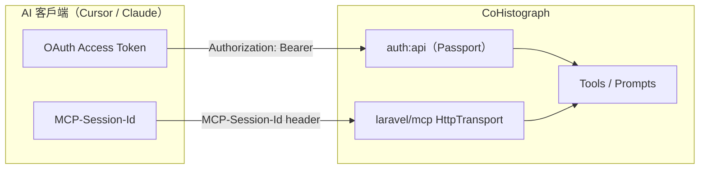

# MCP Session 與登入裝置管理 — 研究筆記

## 目的

釐清兩件常被混為一談的事，並提出本專案可落地的範圍：

1. **MCP Session**（協議層 `MCP-Session-Id`）
2. **登入／授權裝置管理**（使用者可查看、撤銷已授權的 MCP 客戶端）

本文件**僅研究與建議**，尚未實作。

---

## 結論先講

| 概念 | 要不要自己做？ | 理由 |
|------|----------------|------|
| MCP Session 持久化／sticky store | **不做**（或僅審計 log） | `laravel/mcp` 已處理 header；認證靠每請求 Bearer；新版 MCP 規格正走向無 session |
| DELETE 結束 MCP Session | **暫不自幹** | 套件目前對 GET/DELETE 回 405；等上游或有明確客戶端需求再跟 |
| 使用者「已授權應用／裝置」列表與撤銷 | **建議做** | Laravel 官方 MCP 安全建議；Passport token 已具備資料；目前無 UI |
| Passport Device Authorization Grant（`oauth_device_codes`） | **與本需求無關** | 那是 TV／主機輸入碼登入流程，不是「我用哪些裝置登入過」 |

**使用者口中的「登入用裝置管理」，在本專案應對應：管理 MCP OAuth 授權（Passport access / refresh token + client），而不是協議層 MCP Session。**

---

## 兩層模型



- **身分（誰在呼叫）**：Passport OAuth 2.1 access token（scope `mcp:use`）。每請求驗證。
- **協議連線（同一 HTTP MCP 連線的上下文）**：`MCP-Session-Id`。由 `initialize` 產生，客戶端後續帶上。

Laravel 官方提醒：**不要用 session 代替每請求認證**；若有 session 相關事件，應以 `user_id:session_id` 為鍵，而非只有 session id。

---

## 現況盤點（本 repo）

### 已有

- `Mcp::web('/mcp', …)` + `auth:api` + `throttle:mcp`（`routes/ai.php`）
- `Mcp::oauthRoutes()`、動態 Client Registration、授權畫面 `resources/views/mcp/authorize.blade.php`
- Passport 表：`oauth_clients`、`oauth_access_tokens`、`oauth_refresh_tokens`、`oauth_auth_codes`、`oauth_device_codes`
- `User` 實作 `HasApiTokens` / `OAuthenticatable` → 可用 `$user->tokens()`

### 沒有

- 使用者前台「已授權應用／裝置」頁
- 撤銷單一／全部 MCP token 的 UI／路由
- 監聽 `Laravel\Mcp\Events\SessionInitialized` 做審計或裝置 enrichment
- MCP Session 的 server-side store（目前也不需要）
- 選單「個人資料」仍被註解（`MenuService`）

### `laravel/mcp` v0.6.7 行為摘要

| 行為 | 實作 |
|------|------|
| `initialize` | 產生 UUID session id、dispatch `SessionInitialized`、回應 header 帶 `MCP-Session-Id` |
| 後續 POST | 從 request header 讀取 `MCP-Session-Id` 傳入 `HttpTransport` |
| GET / DELETE `/mcp` | **固定 405**，`Allow: POST` |
| STDIO | 行程啟動時產生一個 UUID，無 header 交換 |

`SessionInitialized` 攜帶：`sessionId`、`clientInfo`（name/title/version）、`protocolVersion`、`clientCapabilities`。本專案目前**無人監聽**。

### 規格趨勢（外部）

MCP `2026-07-28` RC 方向：移除傳輸層 session / `Mcp-Session-Id`，改為更無狀態的 HTTP。因此**不應在本專案投資大型 MCP Session 基礎設施**。

---

## 「登入用裝置」應長什麼樣

### 建議產品語意

使用者在網站上看到的是：

> **已授權的 AI 應用**（Cursor、Claude Desktop…）— 可檢視與撤銷

而非：

- 瀏覽器 web session 列表（另議，非 MCP 必需）
- MCP-Session-Id 列表（對使用者無意義、生命週期短）
- Device Code Grant 裝置碼（未用於 MCP）

### 建議資料來源

以 Passport 為準：

```text
oauth_access_tokens
  ├─ user_id
  ├─ client_id  → oauth_clients.name（如 "Cursor"）
  ├─ scopes（mcp:use）
  ├─ revoked / expires_at / created_at
  └─ name（nullable；目前多為空）
```

撤銷時應同時撤銷對應 **refresh token**（`RefreshTokenRepository::revokeRefreshTokensByAccessTokenId`）。

### Dynamic Client Registration 的 UX 注意

MCP 客戶端常透過 `/oauth/register` **每次註冊新 client**。同一個「Cursor」可能對應多筆 `oauth_clients`／多組 token。

建議列表策略（擇一）：

| 策略 | 優點 | 缺點 |
|------|------|------|
| **A. 依 token 列出** | 實作簡單、撤銷精準 | 可能出現多筆同名 Cursor |
| **B. 依 client 聚合**（推薦） | 使用者好理解「這個 Cursor」 | 撤銷需撤該 client 下所有 token |
| **C. 依 client.name 聚合** | 同名客戶端合併 | 可能誤傷不同安裝實例 |

**推薦 B**：一列一個 `oauth_clients`（僅顯示該使用者仍有未撤銷 token 的 client），撤銷 = 撤銷該 client 下此使用者的所有 access + refresh token。可選：一併 `revoked=true` 該 client（較激進，需評估是否影響其他使用者——MCP 動態 client 通常無 owner 或與註冊流程綁定，需查實際 owner 欄位）。

### 建議 UI 位置

- 使用者下拉選單新增「已授權應用」（啟用被註解的個人區入口附近）
- 路由例如：`GET /settings/authorized-apps`、`DELETE /settings/authorized-apps/{token|client}`
- 畫面欄位：應用名稱、授權時間、到期、scope、（可選）最近 MCP client 版本
- 授權成功後可導向或提示：「可至『已授權應用』撤銷」

對齊現有 Bootstrap 5 卡片風格（參考 `mcp/authorize.blade.php`、`user/edit.blade.php`）。

### Laravel 官方建議對照

[Laravel MCP Auth & Security Best Practices](https://laravel.com/blog/laravel-mcp-server-auth-security-best-practices) 明確列出：

- 授權畫面顯示 client 名稱與 redirect URI（已大致具備）
- **允許使用者在帳號設定撤銷 token**（尚未做 ← 本需求核心）
- 新 client 連線可通知（可選）
- MFA before approve（可選、較後）

---

## MCP Session：可選的輕量補強

若仍希望「session 管理」有產品痕跡，建議**只做觀測，不做狀態機**：

1. **Listener**：`SessionInitialized` → 寫 log / 可選寫入 cache：`mcp:last_client:{userId}` = clientInfo  
   - 取得 user：從當下 `auth('api')->user()`（initialize 請求已過 `auth:api`）
2. **不**強制驗證後續請求的 session id 必須曾 initialize（套件目前也未強制存檔）
3. **不**自建 session 表、不 sticky session
4. DELETE session：等 `laravel/mcp` 支援或客戶端真正依賴再處理

這樣「裝置頁」可顯示「最近連線的 MCP client 名稱／版本」，但撤銷仍以 OAuth token 為準。

---

## 明確不在範圍

- 實作 WebMCP / 瀏覽器內 MCP（見 issue #60，另案）
- 瀏覽器「作用中工作階段」裝置列表（Laravel `sessions` 表）— 與 MCP 正交，若要做應獨立規格
- 依賴 `oauth_device_codes` 當裝置管理
- 為水平擴展自建 MCP session store（與未來無狀態規格相衝）

---

## 建議實作分期

### Phase 1 — 已授權應用管理（高價值）

1. `AuthorizedAppController`（或 `McpAuthorizationController`）：index + revoke
2. 查詢目前使用者未撤銷、且 scope 含 `mcp:use` 的 tokens，eager load `client`
3. 依 client 聚合顯示；撤銷該 client 下所有相關 token + refresh token
4. 選單入口；Feature 測試（列表、僅本人、撤銷後 MCP 401）
5. 更新 `.spec/mcp.md` 認證章節一句話連結本文件

### Phase 2 — 輕量審計（可選）

1. `RecordMcpSessionInitialized` listener
2. 授權頁或裝置頁顯示最近 `clientInfo`
3. （可選）新授權 email 通知

### Phase 3 — 協議層（低優先／觀望）

1. 追蹤 `laravel/mcp` 對 DELETE session、無狀態 MCP 的支援
2. 不提前自幹 session store

---

## 待決策（實作前確認）

1. **列表粒度**：依 client 聚合（B）還是依 token（A）？
2. **撤銷範圍**：只撤 token，還是連 `oauth_clients.revoked` 一併標記？
3. **是否包含非 `mcp:use` 的 Passport token**（若未來有其他 API）？
4. **Phase 2 審計**是否與 Phase 1 同 PR，或拆開？
5. 文案要用「已授權應用」還是「登入裝置」？（建議前者，避免與 Device Grant／手機裝置混淆）

---

## 參考

- 本專案：`.spec/mcp.md`
- `laravel/mcp` v0.6.7：`SessionInitialized`、`HttpTransport`、`Registrar::web`
- [Laravel MCP Auth & Security Best Practices](https://laravel.com/blog/laravel-mcp-server-auth-security-best-practices)
- [Laravel Passport — Managing / Revoking Tokens](https://laravel.com/docs/12.x/passport)
- MCP Streamable HTTP / lifecycle（`initialize` + session header；未來 RC 可能移除）
