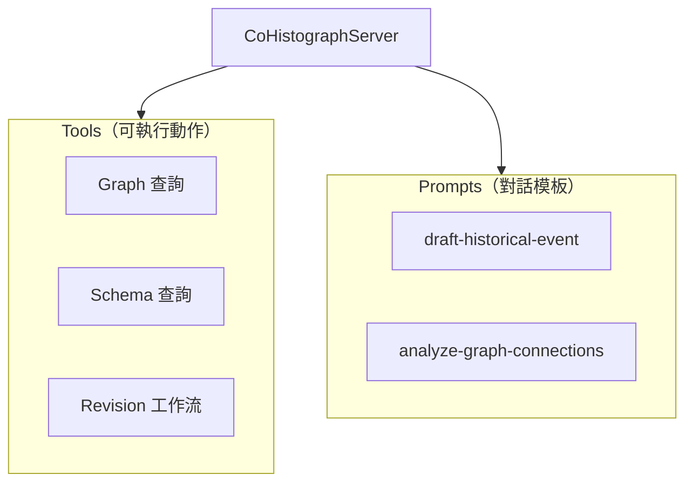

# MCP Server 規格

## 概述

本規格定義 CoHistograph 應用層 MCP Server 的設計，讓 AI 客戶端（Cursor、Claude Desktop 等）能透過 [Model Context Protocol](https://modelcontextprotocol.io/) 查詢知識圖譜、協助撰寫修訂，並在審核流程中提供輔助。

此 MCP Server **與現有 Laravel Boost MCP 並存、職責不同**：

| | Laravel Boost MCP | CoHistograph MCP Server |
|--|-------------------|-------------------------|
| 目的 | AI 開發輔助 | AI 操作業務功能 |
| 狀態 | 已配置（`.mcp.json` → `php artisan boost:mcp`） | 待實作 |
| 工具範例 | `search-docs`、`database-query` | `search-vertices`、`create-revision` |
| 套件 | `laravel/boost`（dev 依賴） | `laravel/mcp`（需直接 require） |

---

## 技術基礎

### 套件與版本

- **laravel/mcp** v0.x（與 Laravel 12 相容，見 `composer.lock` 中 Boost 傳遞依賴版本）
- 沿用現有 **Laratrust** 權限模型
- 複用現有 Service 層，不在 Tool 內重寫業務邏輯

### 安裝步驟（實作時執行）

```bash
composer require laravel/mcp
php artisan vendor:publish --tag=ai-routes
php artisan make:mcp-server CoHistographServer
```

### 目錄結構（實作後）

```
app/Mcp/
├── Servers/
│   └── CoHistographServer.php
├── Tools/
│   ├── Graph/
│   │   ├── SearchVerticesTool.php
│   │   ├── GetVertexDetailTool.php
│   │   └── ListVertexNeighborsTool.php
│   ├── Schema/
│   │   ├── ListVertexTypesTool.php
│   │   └── ListEdgeTypesTool.php
│   └── Revision/
│       ├── CreateRevisionTool.php
│       ├── UpdateRevisionTool.php
│       ├── ValidateRevisionTool.php
│       ├── SubmitRevisionTool.php
│       └── GetRevisionTool.php
└── Prompts/
    ├── DraftHistoricalEventPrompt.php
    └── AnalyzeGraphConnectionsPrompt.php

routes/ai.php                         # MCP Server 註冊
resources/views/mcp/                  # Apps（Phase 3，可選）
tests/Feature/Mcp/                    # MCP 整合測試
```

---

## Server 定義

### CoHistographServer

| 屬性 | 值 |
|------|-----|
| Name | `CoHistograph` |
| Version | `1.0.0` |
| Instructions | 協作式歷史事件知識圖譜平台。可查詢圖譜 Schema 與頂點資料、協助建立與提交修訂。所有圖資料變更須透過 Revision 工作流，不可直接寫入 AGE。領域知識（VertexType / EdgeType 概念、AGE 命名規則、`target_age_id` 與 `target_ref_order` 語意）寫入 Server Instructions，不另建 Resource。 |

### 設計原則：Tools-only

查詢與上下文一律透過 **Tools** 提供，不實作 MCP Resources：

- Schema 總覽 → `list-vertex-types`、`list-edge-types`
- 修訂詳情 → `get-revision`
- 領域說明 → Server `#[Instructions]` 屬性

### 註冊方式

```php
// routes/ai.php
use App\Mcp\Servers\CoHistographServer;
use Laravel\Mcp\Facades\Mcp;

// Web：供遠端 AI 客戶端（需認證）
Mcp::web('/mcp/cohistograph', CoHistographServer::class)
    ->middleware(['auth:sanctum', 'throttle:mcp']);

// Local：供本機編輯器整合（可選，與 Boost 並存）
Mcp::local('cohistograph', CoHistographServer::class);
```

### 傳輸模式選擇

| 模式 | 適用場景 | 認證 |
|------|---------|------|
| **Web（HTTP + SSE）** | 遠端 AI 客戶端、生產環境 | Sanctum API Token 或 OAuth 2.1 |
| **Local（stdio）** | 本機 Cursor / Claude Desktop | 沿用應用程式 `.env` 與 DB 連線 |

初期建議先實作 **Local** 模式（開發驗證成本低），再擴充 Web 模式。

---

## MCP 元素總覽



---

## Tools

Tools 是 AI 可主動呼叫的可執行功能。每個 Tool 須具備：

- `#[Description]`：說明用途，供 AI 判斷何時呼叫
- `schema()`：JSON Schema 定義輸入參數
- `handle()`：委派至現有 Service / Controller 邏輯
- 權限檢查：在 `handle()` 開頭以 `Gate` / Policy 驗證

### Phase 1：Graph 查詢（唯讀，優先實作）

#### `search-vertices`

依類型或屬性條件搜尋頂點。

| 參數 | 型別 | 必填 | 說明 |
|------|------|------|------|
| `vertex_type_label` | string | 是 | AGE label，如 `person`、`event` |
| `limit` | integer | 否 | 預設 20，上限 100 |
| `offset` | integer | 否 | 分頁偏移 |

**委派**：`VertexController::index` 的 Cypher 查詢邏輯，或抽出為 `GraphQueryService`。

**權限**：登入使用者皆可（讀取公開圖資料）。

#### `get-vertex-detail`

取得單一頂點詳情與屬性。

| 參數 | 型別 | 必填 | 說明 |
|------|------|------|------|
| `age_id` | integer | 是 | AGE 頂點 ID |

**委派**：`VertexController::show`。

#### `list-vertex-neighbors`

列出頂點的相鄰節點與邊。

| 參數 | 型別 | 必填 | 說明 |
|------|------|------|------|
| `age_id` | integer | 是 | AGE 頂點 ID |
| `direction` | string | 否 | `outgoing` / `incoming` / `both`，預設 `both` |

**委派**：`VertexController::getVertexEdgeInfo`。

### Phase 1：Schema 查詢（唯讀）

#### `list-vertex-types`

列出所有 VertexType 及其 Property 定義。

無輸入參數。

**委派**：`VertexType::with('properties')->get()`。

#### `list-edge-types`

列出所有 EdgeType 及其 Property、起訖 VertexType。

無輸入參數。

**委派**：`EdgeType::with(['startVertex', 'endVertex', 'properties'])->get()`。

### Phase 2：Revision 工作流（需登入）

Revision 相關 Tool **不得直接寫入 AGE**，所有變更須經 Revision 草稿 → 驗證 → 提交 → 管理員審核流程。

#### `create-revision`

建立空白修訂草稿。

| 參數 | 型別 | 必填 | 說明 |
|------|------|------|------|
| `title` | string | 是 | 修訂標題 |
| `description` | string | 否 | 修訂說明 |

**委派**：`RevisionService::create`。

**權限**：登入使用者。

#### `update-revision`

更新修訂標題、說明與操作列表（覆寫全部 actions）。

| 參數 | 型別 | 必填 | 說明 |
|------|------|------|------|
| `revision_id` | integer | 是 | 修訂 ID |
| `title` | string | 是 | 修訂標題 |
| `description` | string | 否 | 修訂說明 |
| `actions` | array | 是 | 操作列表，結構見下方 |

**actions 單筆結構**（對應 `RevisionAction` 欄位）：

```json
{
  "action": "create_vertex",
  "vertex_type_label": "event",
  "value": { "name": "辛亥革命", "year": 1911 }
}
```

支援的 `action` 值見 `App\Enums\RevisionActionType`：

| action | 說明 |
|--------|------|
| `create_vertex` | 建立頂點 |
| `delete_vertex` | 刪除頂點 |
| `create_edge` | 建立邊 |
| `delete_edge` | 刪除邊 |
| `create_vertex_property` | 新增頂點屬性值 |
| `update_vertex_property` | 更新頂點屬性值 |
| `delete_vertex_property` | 刪除頂點屬性值 |
| `create_edge_property` | 新增邊屬性值 |
| `update_edge_property` | 更新邊屬性值 |
| `delete_edge_property` | 刪除邊屬性值 |

**委派**：`RevisionService::update`。

**權限**：`RevisionPolicy::update`（本人且狀態為 draft）。

#### `validate-revision`

驗證修訂草稿，回傳驗證結果。

| 參數 | 型別 | 必填 | 說明 |
|------|------|------|------|
| `revision_id` | integer | 是 | 修訂 ID |

**委派**：`RevisionValidationService::validate`。

**權限**：`RevisionPolicy::view`。

#### `submit-revision`

提交修訂至待審核狀態。

| 參數 | 型別 | 必填 | 說明 |
|------|------|------|------|
| `revision_id` | integer | 是 | 修訂 ID |

**委派**：`RevisionService::submit`。

**權限**：`RevisionPolicy::update`（本人且驗證通過）。

#### `get-revision`

取得修訂詳情（含 actions 與最後驗證結果）。

| 參數 | 型別 | 必填 | 說明 |
|------|------|------|------|
| `revision_id` | integer | 是 | 修訂 ID |

**委派**：`Revision::with('actions')->findOrFail`。

**權限**：`RevisionPolicy::view`。

---

## Prompts

Prompts 提供可重用的對話模板，引導 AI 以正確格式與領域知識回應。

### `draft-historical-event`（DraftHistoricalEventPrompt）

| 參數 | 必填 | 說明 |
|------|------|------|
| `event_name` | 是 | 歷史事件名稱 |
| `vertex_type_label` | 否 | 目標 VertexType label，預設由 AI 依 Schema 推斷 |

**用途**：引導 AI 依現有 Schema 結構，產出符合 `create_vertex` action 格式的修訂草稿 JSON。

### `analyze-graph-connections`（AnalyzeGraphConnectionsPrompt）

| 參數 | 必填 | 說明 |
|------|------|------|
| `age_id` | 是 | 起始頂點 AGE ID |
| `depth` | 否 | 探索深度，預設 2 |

**用途**：引導 AI 先呼叫 `get-vertex-detail` 與 `list-vertex-neighbors`，再分析關聯脈絡。

---

## Apps（Phase 3，可選）

MCP Apps 可在支援的 AI 主機中渲染互動 HTML（iframe）。

### `graph-subgraph-dashboard`（GraphSubgraphDashboardApp）

- 複用現有 D3 視覺化邏輯（`resources/js/Pages/GraphSchema/Visualization.vue`）
- 搭配 `#[RendersApp]` 的 `explore-subgraph` Tool
- 讓 AI 在對話中直接展示頂點子圖

此為進階功能，Phase 1–2 完成後再評估。

---

## 認證與授權

### 認證

| 模式 | 方案 |
|------|------|
| Local | 無額外認證；以 `.env` 連線的本機 DB 為準。Tool 內 `$request->user()` 可為 null，唯讀 Tool 允許匿名，寫入 Tool 須模擬登入使用者（測試用 `actingAs`） |
| Web | Laravel Sanctum API Token；Header：`Authorization: Bearer {token}` |

### 授權對照表

| MCP 元素 | 權限需求 |
|----------|---------|
| Graph 查詢 Tools | 無（公開讀取） |
| Schema 查詢 Tools | 無 |
| `create-revision` 等寫入 Tools | 登入使用者 |
| `update-revision` / `submit-revision` / `get-revision` | 本人或管理員（`RevisionPolicy`） |

### Rate Limiting

Web 模式建議在 `routes/ai.php` 加上 `throttle:mcp` middleware，並於 `AppServiceProvider` 或 `bootstrap/app.php` 定義：

```php
RateLimiter::for('mcp', function (Request $request) {
    return Limit::perMinute(60)->by($request->user()?->id ?: $request->ip());
});
```

---

## 實作階段

### Phase 1：基礎架構與唯讀查詢

1. `composer require laravel/mcp`、發布 `routes/ai.php`
2. 建立 `CoHistographServer` 與 Graph / Schema 唯讀 Tools
3. Local 模式註冊，以 MCP Inspector 驗證
4. Feature 測試：`tests/Feature/Mcp/GraphToolsTest.php`

### Phase 2：Revision 工作流

1. 實作 Revision Tools（create / update / validate / submit / get）
2. 建立 `DraftHistoricalEventPrompt`
3. Feature 測試：`tests/Feature/Mcp/RevisionToolsTest.php`

### Phase 3：進階功能（可選）

1. Web 模式 + Sanctum 認證
2. `AnalyzeGraphConnectionsPrompt`
3. Graph Subgraph App

---

## 測試策略

### 單元 / Feature 測試

使用 `Mcp::fake()` 與 `actingAs`：

```php
Mcp::fake(CoHistographServer::class);

$response = Mcp::tool(SearchVerticesTool::class, [
    'vertex_type_label' => 'event',
    'limit' => 10,
]);

$response->assertOk();
```

### 涵蓋範圍

| 測試類型 | 重點 |
|----------|------|
| Tool 輸入驗證 | 缺少必填參數、無效 label |
| 權限 | 未登入呼叫寫入 Tool、非本人更新修訂 |
| 業務邏輯 | 驗證失敗時 submit 被拒、Schema 查詢結果正確 |

### 手動驗證

```bash
php artisan mcp:inspect cohistograph   # Local Server
```

---

## 與現有程式碼的對應

| MCP 元素 | 現有程式碼 |
|----------|-----------|
| `search-vertices` | `VertexController::index` |
| `get-vertex-detail` | `VertexController::show` |
| `list-vertex-neighbors` | `VertexController::getVertexEdgeInfo` |
| `list-vertex-types` | `VertexType` model |
| `list-edge-types` | `EdgeType` model |
| `create-revision` | `RevisionService::create` |
| `update-revision` | `RevisionService::update` |
| `validate-revision` | `RevisionValidationService::validate` |
| `submit-revision` | `RevisionService::submit` |
| Schema 狀態查詢 | `AgeGraphStateManager` |

**原則**：Tool 的 `handle()` 應委派至上述 Service / Controller，不在 MCP 層重複業務邏輯。若 Controller 邏輯過於耦合 View，實作 Phase 1 時應先抽出 `GraphQueryService`。

---

## 開發慣例

- MCP 相關類別置於 `app/Mcp/`，遵循 `laravel/mcp` 的 `make:mcp-*` 生成結構
- 每個 Tool 必須有 `#[Description]`，description 以繁體中文撰寫（與應用程式 UI 一致）
- 錯誤訊息須清晰可操作，供 AI 自行修正後重試
- 遵循 `.spec/revision.md` 中的 Revision action 結構與驗證規則
- PHP 檔案修改後執行 `vendor/bin/pint --dirty`
- 每個 Phase 完成後執行 `composer run test` 與 `composer run phpstan`

---

## 參考資料

- [Laravel MCP 官方文件](https://laravel.com/docs/mcp)
- [Model Context Protocol 規格](https://modelcontextprotocol.io/docs/getting-started/intro)
- 本專案：`.spec/revision.md`（Revision 工作流詳細規格）
- 本專案：`AGENTS.md`（Laravel Boost MCP 開發指引）
