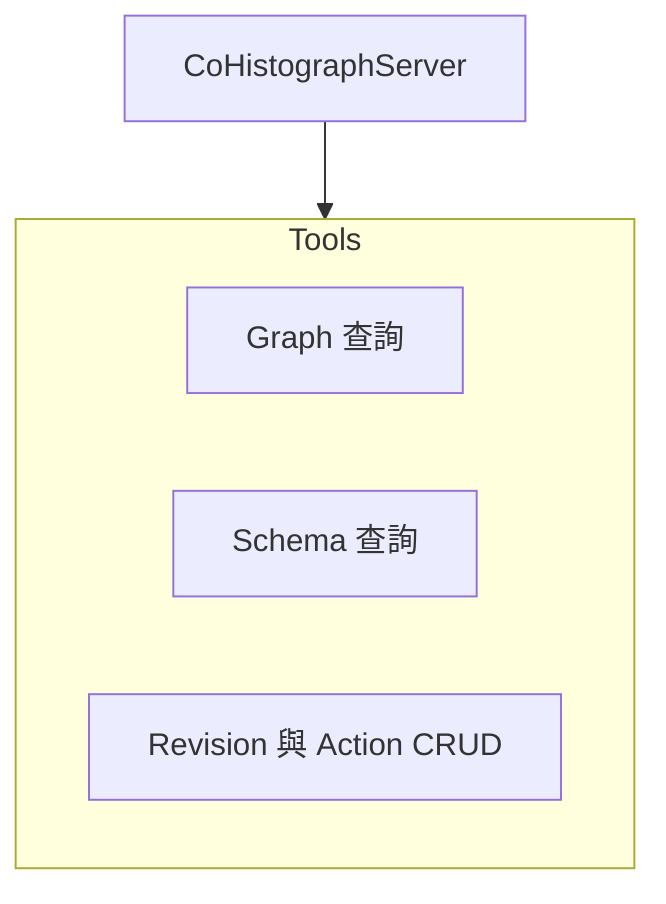

# MCP Server 規格

## 概述

本規格定義 CoHistograph 應用層 MCP Server 的設計，讓 AI 客戶端（Cursor、Claude Desktop 等）能透過 [Model Context Protocol](https://modelcontextprotocol.io/) 查詢知識圖譜、協助撰寫修訂，並在審核流程中提供輔助。

此 MCP Server **與現有 Laravel Boost MCP 並存、職責不同**：

| | Laravel Boost MCP | CoHistograph MCP Server |
|--|-------------------|-------------------------|
| 目的 | AI 開發輔助 | AI 操作業務功能 |
| 狀態 | 已配置（`.mcp.json` → `php artisan boost:mcp`） | 待實作 |
| 工具範例 | `search-docs`、`database-query` | `search-vertices`、`create-revision` |
| 套件 | `laravel/boost`（dev 依賴） | `laravel/mcp`（需直接 require） |

---

## 技術基礎

### 套件與版本

- **laravel/mcp** v0.x（與 Laravel 12 相容，見 `composer.lock` 中 Boost 傳遞依賴版本）
- 沿用現有 **Laratrust** 權限模型
- 複用現有 Service 層，不在 Tool 內重寫業務邏輯

### 安裝步驟（實作時執行）

```bash
composer require laravel/mcp
php artisan vendor:publish --tag=ai-routes
php artisan make:mcp-server CoHistographServer
```

### 目錄結構（實作後）

```
app/Mcp/
├── Servers/
│   └── CoHistographServer.php
├── Tools/
│   ├── Graph/
│   │   ├── SearchVerticesTool.php
│   │   ├── GetVertexDetailTool.php
│   │   └── ListVertexNeighborsTool.php
│   ├── Schema/
│   │   ├── ListVertexTypesTool.php
│   │   └── ListEdgeTypesTool.php
│   └── Revision/
│       ├── CreateRevisionTool.php
│       ├── UpdateRevisionTool.php
│       ├── ListRevisionActionsTool.php
│       ├── AddRevisionActionTool.php
│       ├── UpdateRevisionActionTool.php
│       ├── DeleteRevisionActionTool.php
│       ├── MoveRevisionActionTool.php
│       ├── SubmitRevisionTool.php
│       └── GetRevisionTool.php

routes/ai.php                         # MCP Server 註冊
tests/Feature/Mcp/                    # MCP 整合測試
```

---

## Server 定義

### CoHistographServer

| 屬性 | 值 |
|------|-----|
| Name | `CoHistograph` |
| Version | `1.0.0` |
| Instructions | 協作式歷史事件知識圖譜平台。可查詢圖譜 Schema 與頂點資料、協助建立與提交修訂。所有圖資料變更須透過 Revision 工作流，不可直接寫入 AGE。領域知識（VertexType / EdgeType 概念、AGE 命名規則、`target_age_id` 與 `target_ref_order` 語意）寫入 Server Instructions，不另建 Resource。 |

### 設計原則：Tools-only

查詢與上下文一律透過 **Tools** 提供，不實作 MCP Resources：

- Schema 總覽 → `list-vertex-types`、`list-edge-types`
- 修訂詳情 → `get-revision`
- 領域說明 → Server `#[Instructions]` 屬性

### 註冊方式

```php
// routes/ai.php
use App\Mcp\Servers\CoHistographServer;
use Laravel\Mcp\Facades\Mcp;

// Web：供遠端 AI 客戶端（需認證）
Mcp::web('/mcp/cohistograph', CoHistographServer::class)
    ->middleware(['auth:sanctum', 'throttle:mcp']);

// Local：供本機編輯器整合（可選，與 Boost 並存）
Mcp::local('cohistograph', CoHistographServer::class);
```

### 傳輸模式選擇

| 模式 | 適用場景 | 認證 |
|------|---------|------|
| **Web（HTTP + SSE）** | 遠端 AI 客戶端、生產環境 | Sanctum API Token 或 OAuth 2.1 |
| **Local（stdio）** | 本機 Cursor / Claude Desktop | 沿用應用程式 `.env` 與 DB 連線 |

初期建議先實作 **Local** 模式（開發驗證成本低），再擴充 Web 模式。

---

## MCP 元素總覽



---

## Tools

Tools 是 AI 可主動呼叫的可執行功能。每個 Tool 須具備：

- `#[Description]`：說明用途，供 AI 判斷何時呼叫
- `schema()`：JSON Schema 定義輸入參數
- `handle()`：委派至現有 Service / Controller 邏輯
- 權限檢查：在 `handle()` 開頭以 `Gate` / Policy 驗證

### Graph 查詢

#### `search-vertices`

依類型列出頂點，或以文字搜尋頂點屬性。

| 參數 | 型別 | 必填 | 說明 |
|------|------|------|------|
| `vertex_type_label` | string | 是 | AGE label，如 `person`、`event` |
| `query` | string | 否 | 文字搜尋關鍵字；有值時改為搜尋模式 |
| `property` | string | 否 | 限定搜尋的 `age_property_name`；省略時搜尋該 VertexType 所有 `STRING` 屬性 |
| `limit` | integer | 否 | 預設 20，上限 100 |
| `offset` | integer | 否 | 分頁偏移 |

**搜尋行為**（當 `query` 有值時）：

- 比對方式：不分大小寫的子字串比對（Cypher `CONTAINS` 或等效語意）
- 未指定 `property`：對該 VertexType 在 `vertex_properties` 中定義為 `STRING` 的所有屬性做 OR 條件比對
- 指定 `property`：僅比對該屬性；若該屬性不存在或非 `STRING` 類型，回傳驗證錯誤
- `query` 長度 1–100 字元，前後空白 trim

**列出行為**（當 `query` 省略時）：

- 回傳該類型所有頂點（依 `limit` / `offset` 分頁）

**回應**：

```json
{
  "vertex_type_label": "event",
  "query": "辛亥",
  "total": 3,
  "vertices": [
    {
      "age_id": 42,
      "label": "event",
      "properties": { "name": "辛亥革命", "year": 1911 }
    }
  ]
}
```

**委派**：參考 `VertexController::index` 的 Cypher 模式；有 `query` 時以 `VertexType::with('properties')` 取得可搜尋欄位，組出 `WHERE v.{property} CONTAINS $query` 條件（多欄位 OR）。可抽出為 `GraphQueryService::searchVertices()` 供 Web 與 MCP 共用。

**權限**：登入使用者皆可（讀取公開圖資料）。

#### `get-vertex-detail`

取得單一頂點詳情與屬性。

| 參數 | 型別 | 必填 | 說明 |
|------|------|------|------|
| `age_id` | integer | 是 | AGE 頂點 ID |

**委派**：`VertexController::show`。

#### `list-vertex-neighbors`

列出頂點的相鄰節點與邊。

| 參數 | 型別 | 必填 | 說明 |
|------|------|------|------|
| `age_id` | integer | 是 | AGE 頂點 ID |
| `direction` | string | 否 | `outgoing` / `incoming` / `both`，預設 `both` |

**委派**：`VertexController::getVertexEdgeInfo`。

### Schema 查詢

#### `list-vertex-types`

列出所有 VertexType 及其 Property 定義。

無輸入參數。

**委派**：`VertexType::with('properties')->get()`。

#### `list-edge-types`

列出所有 EdgeType 及其 Property、起訖 VertexType。

無輸入參數。

**委派**：`EdgeType::with(['startVertex', 'endVertex', 'properties'])->get()`。

### Revision 工作流

Revision 相關 Tool **不得直接寫入 AGE**，所有變更須經 Revision 草稿 → 驗證 → 提交 → 管理員審核流程。

**Action 編輯策略**：不以整份 `actions` 陣列覆寫修訂，改以單筆 CRUD 與排序 Tool 操作，避免 AI 每次修改都需傳送完整 action 列表。

#### Action 欄位結構

單筆 action 對應 `RevisionAction` 模型，欄位如下（依 `action` 類型填寫對應欄位）：

| 欄位 | 型別 | 說明 |
|------|------|------|
| `action` | string | 十種 action 之一，見下表 |
| `target_age_id` | integer | 操作對象 AGE graphid（與 `target_ref_order` 互斥） |
| `target_ref_order` | integer | 引用同 Revision 內 `create_vertex` / `create_edge` 的 `order` |
| `vertex_type_label` | string | `create_vertex` 時必填 |
| `edge_type_label` | string | `create_edge` 時必填 |
| `start_vertex_age_id` | integer | `create_edge` 起點（與 `start_vertex_ref_order` 互斥） |
| `start_vertex_ref_order` | integer | `create_edge` 起點引用同 Revision 內 `create_vertex` 的 `order` |
| `end_vertex_age_id` | integer | `create_edge` 終點（與 `end_vertex_ref_order` 互斥） |
| `end_vertex_ref_order` | integer | `create_edge` 終點引用同 Revision 內 `create_vertex` 的 `order` |
| `age_property_name` | string | property 相關 action 時必填 |
| `value` | mixed | 屬性值或 `create_vertex` 初始屬性（JSON） |

| action | 說明 |
|--------|------|
| `create_vertex` | 建立頂點 |
| `delete_vertex` | 刪除頂點 |
| `create_edge` | 建立邊 |
| `delete_edge` | 刪除邊 |
| `create_vertex_property` | 新增頂點屬性值 |
| `update_vertex_property` | 更新頂點屬性值 |
| `delete_vertex_property` | 刪除頂點屬性值 |
| `create_edge_property` | 新增邊屬性值 |
| `update_edge_property` | 更新邊屬性值 |
| `delete_edge_property` | 刪除邊屬性值 |

`order` 為 0-based 連續整數，決定 action 執行順序與 `*_ref_order` 引用目標。調整順序後，其他 action 的 `order` 會重新編號；若某 action 的 `*_ref_order` 引用受影響，驗證結果會指出錯誤。

#### 變更後回應格式

所有會修改 Revision 或 action 的 Tool（`update-revision`、`add-revision-action`、`update-revision-action`、`delete-revision-action`、`move-revision-action`）完成後，**一律重新驗證並回傳**以下結構：

```json
{
  "revision": {
    "id": 1,
    "title": "新增辛亥革命",
    "description": null,
    "status": "draft",
    "last_validated_at": "2026-07-07T08:00:00+00:00"
  },
  "actions": [
    {
      "id": 10,
      "order": 0,
      "action": "create_vertex",
      "vertex_type_label": "event",
      "value": { "name": "辛亥革命" }
    }
  ],
  "validation": {
    "is_valid": false,
    "summary": "檢查未通過，請修正錯誤後再繼續",
    "general_errors": [],
    "action_errors": {
      "0": ["頂點類型 event 的屬性 year 為必填"]
    }
  }
}
```

**委派**：各 Tool 完成資料庫操作後，呼叫 `RevisionValidationService::validate`，並將結果寫回 `revision.last_validation_*` 欄位（與現有 `RevisionService::update` 行為一致）。

#### `create-revision`

建立空白修訂草稿。

| 參數 | 型別 | 必填 | 說明 |
|------|------|------|------|
| `title` | string | 是 | 修訂標題 |
| `description` | string | 否 | 修訂說明 |

**委派**：`RevisionService::create`。

**權限**：登入使用者。

**回應**：空 `actions` 的變更後回應格式（驗證通常通過）。

#### `update-revision`

更新修訂標題與說明（**不含 actions**）。

| 參數 | 型別 | 必填 | 說明 |
|------|------|------|------|
| `revision_id` | integer | 是 | 修訂 ID |
| `title` | string | 是 | 修訂標題 |
| `description` | string | 否 | 修訂說明 |

**委派**：更新 `Revision` 標題/說明後觸發驗證。

**權限**：`RevisionPolicy::update`（本人且狀態為 draft）。

**回應**：變更後回應格式。

#### `list-revision-actions`

列出修訂的所有 action（依 `order` 升序）。

| 參數 | 型別 | 必填 | 說明 |
|------|------|------|------|
| `revision_id` | integer | 是 | 修訂 ID |

**委派**：`Revision::with('actions')->findOrFail`，回傳 `actions` 與最後驗證結果（不觸發新驗證）。

**權限**：`RevisionPolicy::view`。

#### `add-revision-action`

在指定位置新增一筆 action。

| 參數 | 型別 | 必填 | 說明 |
|------|------|------|------|
| `revision_id` | integer | 是 | 修訂 ID |
| `order` | integer | 是 | 插入位置（0-based）；既有 `order >= 此值` 的 action 往後遞延 |
| `action` | object | 是 | action 欄位結構，見上方 |

**委派**：新增 `RevisionAction` 並重新編號 `order`，觸發驗證。

**權限**：`RevisionPolicy::update`（本人且狀態為 draft）。

**回應**：變更後回應格式。

#### `update-revision-action`

更新單筆 action 內容（不含排序）。

| 參數 | 型別 | 必填 | 說明 |
|------|------|------|------|
| `revision_id` | integer | 是 | 修訂 ID |
| `action_id` | integer | 是 | `revision_actions.id` |
| `action` | object | 是 | 完整 action 欄位（覆寫該筆） |

**委派**：更新指定 `RevisionAction`，`order` 不變，觸發驗證。

**權限**：`RevisionPolicy::update`（本人且狀態為 draft）。

**回應**：變更後回應格式。

#### `delete-revision-action`

刪除單筆 action。

| 參數 | 型別 | 必填 | 說明 |
|------|------|------|------|
| `revision_id` | integer | 是 | 修訂 ID |
| `action_id` | integer | 是 | `revision_actions.id` |

**委派**：刪除指定 `RevisionAction`，其後 action 的 `order` 遞減補齊，觸發驗證。

**權限**：`RevisionPolicy::update`（本人且狀態為 draft）。

**回應**：變更後回應格式。

#### `move-revision-action`

移動 action 至新位置。

| 參數 | 型別 | 必填 | 說明 |
|------|------|------|------|
| `revision_id` | integer | 是 | 修訂 ID |
| `action_id` | integer | 是 | `revision_actions.id` |
| `to_order` | integer | 條件必填 | 目標位置（0-based）；與 `direction` 二擇一 |
| `direction` | string | 條件必填 | `up` 或 `down`，與相鄰 action 交換；與 `to_order` 二擇一 |

- 使用 `to_order`：將該 action 移至指定位置，其餘 action 順序重排為連續 0..n-1。
- 使用 `direction`：與上一筆（`up`）或下一筆（`down`）交換；已在最前/最後時回傳錯誤。

**委派**：重排 `order` 後觸發驗證。

**權限**：`RevisionPolicy::update`（本人且狀態為 draft）。

**回應**：變更後回應格式。

#### `submit-revision`

提交修訂至待審核狀態。

| 參數 | 型別 | 必填 | 說明 |
|------|------|------|------|
| `revision_id` | integer | 是 | 修訂 ID |

**委派**：`RevisionService::submit`。

**權限**：`RevisionPolicy::update`（本人且驗證通過）。

#### `get-revision`

取得修訂詳情（含 actions 與最後驗證結果）。

| 參數 | 型別 | 必填 | 說明 |
|------|------|------|------|
| `revision_id` | integer | 是 | 修訂 ID |

**委派**：`Revision::with('actions')->findOrFail`。

**權限**：`RevisionPolicy::view`。

---

## 認證與授權

### 認證

| 模式 | 方案 |
|------|------|
| Local | 無額外認證；以 `.env` 連線的本機 DB 為準。Tool 內 `$request->user()` 可為 null，唯讀 Tool 允許匿名，寫入 Tool 須模擬登入使用者（測試用 `actingAs`） |
| Web | Laravel Sanctum API Token；Header：`Authorization: Bearer {token}` |

### 授權對照表

| MCP 元素 | 權限需求 |
|----------|---------|
| Graph 查詢 Tools | 無（公開讀取） |
| Schema 查詢 Tools | 無 |
| `create-revision` 等寫入 Tools | 登入使用者 |
| `update-revision` / action CRUD / `move-revision-action` / `submit-revision` | 本人（`RevisionPolicy::update`，draft 狀態） |
| `list-revision-actions` / `get-revision` | 本人或管理員（`RevisionPolicy::view`） |

### Rate Limiting

Web 模式建議在 `routes/ai.php` 加上 `throttle:mcp` middleware，並於 `AppServiceProvider` 或 `bootstrap/app.php` 定義：

```php
RateLimiter::for('mcp', function (Request $request) {
    return Limit::perMinute(60)->by($request->user()?->id ?: $request->ip());
});
```

---

## 實作清單

1. `composer require laravel/mcp`、發布 `routes/ai.php`
2. 建立 `CoHistographServer`，註冊所有 Tools
3. 實作 Graph / Schema Tools 與 Revision Tools（含 action CRUD、排序）
4. 以 Local 模式註冊，用 MCP Inspector 驗證；視需求擴充 Web 模式與 Sanctum 認證
5. Feature 測試：`tests/Feature/Mcp/GraphToolsTest.php`、`tests/Feature/Mcp/RevisionToolsTest.php`

---

## 實作備註

**盡可能重新利用現有 code**，避免在 MCP 層或平行路徑重複業務邏輯。優先委派對象：

| 現有程式碼 | 可複用於 |
|-----------|---------|
| `RevisionService` | 建立/提交修訂、變更後寫回 `last_validation_*` |
| `RevisionValidationService` | 每次 action 變更後的驗證 |
| `RevisionService::validateDraftData` | 組裝暫存 actions 後驗證（若尚未持久化） |
| `Revision` / `RevisionAction` model | 單筆 CRUD 與 `order` 重排 |
| `RevisionPolicy` | 權限檢查 |
| `VertexController`、相關 Service | Graph 查詢 |
| `AgeGraphStateManager` | Schema 狀態查詢 |

僅在現有 Service 無法合理表達單筆 action 操作（如 `order` 重排）時，才擴充 `RevisionService` 或抽出小範圍共用方法；**不為 MCP 另建一套平行流程**。

Tool 的 `handle()` 只負責參數解析、授權、呼叫既有 Service/Model、格式化回應。若 Controller 邏輯過於耦合 View，應先抽出可共用的查詢方法，而非在 Tool 內重寫 Cypher。

---

## 測試策略

### 單元 / Feature 測試

使用 `Mcp::fake()` 與 `actingAs`：

```php
Mcp::fake(CoHistographServer::class);

$response = Mcp::tool(SearchVerticesTool::class, [
    'vertex_type_label' => 'event',
    'limit' => 10,
]);

$response->assertOk();
```

### 涵蓋範圍

| 測試類型 | 重點 |
|----------|------|
| Tool 輸入驗證 | 缺少必填參數、無效 label |
| 權限 | 未登入呼叫寫入 Tool、非本人更新修訂 |
| 業務邏輯 | 驗證失敗時 submit 被拒、Schema 查詢結果正確 |
| Action CRUD | 新增/更新/刪除/移動後 `order` 重排正確、回應含驗證結果 |
| `*_ref_order` | 重排後引用失效時驗證錯誤訊息正確 |

### 手動驗證

```bash
php artisan mcp:inspect cohistograph   # Local Server
```

---

## 與現有程式碼的對應

| MCP 元素 | 現有程式碼 |
|----------|-----------|
| `search-vertices` | `VertexController::index` |
| `get-vertex-detail` | `VertexController::show` |
| `list-vertex-neighbors` | `VertexController::getVertexEdgeInfo` |
| `list-vertex-types` | `VertexType` model |
| `list-edge-types` | `EdgeType` model |
| `create-revision` | `RevisionService::create` |
| `update-revision` | `Revision` 更新 + `RevisionValidationService::validate` |
| `list-revision-actions` | `Revision::with('actions')` |
| `add-revision-action` | `Revision` / `RevisionAction` + `RevisionValidationService`（擴充 `RevisionService` 若已有共用方法） |
| `update-revision-action` | 同上 |
| `delete-revision-action` | 同上 |
| `move-revision-action` | 同上 |
| `submit-revision` | `RevisionService::submit` |
| `get-revision` | `Revision::with('actions')` |
| 變更後驗證 | `RevisionValidationService::validate`（參考 `RevisionService::update` 寫回驗證欄位） |
| Schema 狀態查詢 | `AgeGraphStateManager` |

---

## 開發慣例

- MCP 相關類別置於 `app/Mcp/`，遵循 `laravel/mcp` 的 `make:mcp-*` 生成結構
- 每個 Tool 必須有 `#[Description]`，description 以繁體中文撰寫（與應用程式 UI 一致）
- 錯誤訊息須清晰可操作，供 AI 自行修正後重試
- 遵循 `.spec/revision.md` 中的 Revision action 結構與驗證規則
- PHP 檔案修改後執行 `vendor/bin/pint --dirty`
- 完成後執行 `composer run test` 與 `composer run phpstan`

---

## 參考資料

- [Laravel MCP 官方文件](https://laravel.com/docs/mcp)
- [Model Context Protocol 規格](https://modelcontextprotocol.io/docs/getting-started/intro)
- 本專案：`.spec/revision.md`（Revision 工作流詳細規格）
- 本專案：`AGENTS.md`（Laravel Boost MCP 開發指引）
