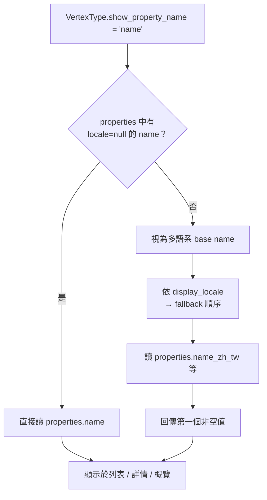

# Vertex 顯示名稱（`show_property_name`）設計方案

## 與多語系 Property 的關係

本文件處理 [`localized-property.md`](./localized-property.md) **刻意排除**的範圍。

方案 A 將一個概念拆成多筆 property（`name_zh_tw`、`name_ja_jp`…），AGE 上不再有單一 `name` 欄位。但 `VertexType.show_property_name` 目前直接作為 AGE property key 讀取顯示值，兩者語意衝突。

**建議實作順序：**

1. 先完成 `localized-property.md`（Schema 層 `locale` 欄位、property 建立流程）
2. 再依本文件處理 `show_property_name` 與所有顯示層

---

## 現況

### 資料庫

`vertex_types.show_property_name`（nullable string）儲存單一 `age_property_name`，例如 `name`。

### 管理 UI

`VertexTypeController@edit` 從該 type 的 properties 產生下拉選項（value = `age_property_name`，label = `name`）。僅在編輯 VertexType 時可設定。

### 讀取位置（所有皆為 `$vertex->properties[$vertexType->show_property_name]`）

| 檔案 | 用途 |
|------|------|
| `resources/views/graph/vertex/show.blade.php` | 頁面 title、h1 標題 |
| `resources/views/graph/vertex/index.blade.php` | Vertex 列表卡片標題 |
| `resources/views/graph/vertex/all-type.blade.php` | 跨類型列表卡片標題 |
| `resources/views/overview.blade.php` | 首頁概覽卡片標題 |
| `resources/views/graph/vertex/show.blade.php`（Edge 區塊） | 關聯 Vertex 連結文字（含 `?? 'name'` fallback） |

### 問題

多語系後若 `show_property_name = 'name'`，AGE 讀取會得到空值或 undefined。管理員若改選 `name_zh_tw`，全站固定顯示繁中，無法依瀏覽語系切換。

---

## 設計目標

1. **向後相容**：既有 `show_property_name = 'name'`（非多語系）不受影響
2. **多語系可運作**：property 改為 `name_zh_tw` 等後，顯示層仍能取得正確文字
3. **單一解析入口**：避免各 Blade 重複寫 fallback 邏輯
4. **管理 UI 可理解**：管理員能清楚選擇「用哪個屬性當顯示名稱」

---

## 方案比較

### 方案 A：維持存完整 `age_property_name`（最小改動）

`show_property_name` 語意不變，管理員選 `name_zh_tw` 等具體欄位。

| 優點 | 缺點 |
|------|------|
| 無 DB migration、無語意變更 | 全站固定單一語言顯示 |
| 驗證規則幾乎不變 | 既有 `show_property_name = 'name'` 在多語系遷移後會失效，需手動重設 |
| 實作快 | 無法依使用者語系動態切換 |

### 方案 B：改存 base name + runtime 解析（建議）

`show_property_name` 儲存**語意上的屬性名稱**（base name），執行時依 locale 解析成實際 AGE key。

| 優點 | 缺點 |
|------|------|
| 全站可依語系顯示對應版本 | 需新增 resolver 與 config |
| 管理員選「姓名」概念，不需選語言 | 需處理既有資料遷移 |
| 非多語系 property（`birth_year`）行為不變 | 下拉選項 UI 需重新設計 |

**建議採用方案 B。**

---

## 方案 B 設計細節

### 1. `show_property_name` 語意

| Property 類型 | `show_property_name` 儲存值 | 範例 |
|---------------|------------------------------|------|
| 非多語系（`locale = null`） | 完整 `age_property_name` | `birth_year` |
| 多語系群組 | base name（不含 `_{locale}` 後綴） | `name` |

驗證規則：

- 必須對應到該 VertexType 下**存在**的 property 或 property 群組
- 多語系群組：至少有一筆 `locale != null` 且 base name 相符的 property
- 不可指向不存在的 base name

### 2. 顯示用 locale 設定

在 `config/cohistograph/app.php` 的 `graph` 區塊新增：

```php
'graph' => [
    // 現有 connection-name, name, locales...
    'display_locale' => env('COHISTOGRAPH_DISPLAY_LOCALE', 'zh_tw'),
    'display_locale_fallback' => ['zh_tw', 'en_us', 'ja_jp'],
],
```

- `display_locale`：解析顯示名稱時優先使用的 locale
- `display_locale_fallback`：當優先 locale 無值時，依序嘗試的 locale 列表（值須為 `locales` config 的 key）

> 本階段**不**綁定 Laravel `APP_LOCALE`，站點顯示語言由 graph config 統一控制。未來若要做 per-user locale，再擴充 resolver 參數即可。

### 3. `VertexDisplayNameResolver`（新建 Service）

```php
// app/Services/Graph/VertexDisplayNameResolver.php

/**
 * @param  array<string, mixed>  $properties  Vertex 的 AGE properties
 * @param  \Illuminate\Support\Collection<int, \App\Models\VertexProperty>  $propertyDefinitions
 */
public function resolve(
    ?string $showPropertyName,
    array $properties,
    Collection $propertyDefinitions,
    ?string $locale = null,
): string
```

解析流程：

```
1. show_property_name 為 null → 回傳空字串

2. 在 propertyDefinitions 中找 age_property_name === show_property_name
   → 找到且 locale === null：直接回傳 properties[show_property_name]
   → 找到且 locale !== null：視為舊資料（完整 suffixed name），直接讀取（向後相容）

3. 將 show_property_name 視為 base name，篩出 locale != null 且
   age_property_name === "{base}_{locale}" 的 properties

4. 若無多語系 property → 回傳空字串（base name 不存在）

5. 依 locale（參數或 config display_locale）→ display_locale_fallback 順序
   嘗試讀取 properties["{base}_{locale}"]，取第一個非空值

6. 全部為空 → 回傳空字串
```

### 4. 既有資料遷移

新增 migration 或 one-off command，處理已設定 `show_property_name` 的 VertexType：

| 現有值 | 對應 properties | 遷移動作 |
|--------|-----------------|----------|
| `name` | 僅 `name`（非多語系） | 不變 |
| `name` | 已有 `name_zh_tw` 等，無 `name` | 維持 `name`（作為 base name，符合方案 B） |
| `name_zh_tw` | 有 `name_zh_tw` | 改為 `name`（剝除已知 locale 後綴） |

剝除後綴邏輯：若 `show_property_name` 以 `_{locale}` 結尾且該 locale 在 config `locales` 中存在，且對應 property 存在，則改存 base name。

### 5. Schema 管理 UI

`VertexTypeController@edit` 下拉選項改為**語意選項**，而非逐筆 locale property：

**非多語系 property：**

```
出生年份 (birth_year)
```

**多語系群組（合併為一項）：**

```
姓名 (name) — 多語系
```

- value：非多語系用 `age_property_name`；多語系用 base name
- label：取該群組中 `display_locale` 對應 property 的 `name`，加上「多語系」標示；若該 locale 不存在則取群組內第一筆的 `name`

`vertex-type/show.blade.php` 顯示時：

- 非多語系：顯示 `birth_year`
- 多語系：顯示 `name（多語系，顯示語言：zh_tw）`

### 6. 顯示層改動

所有讀取 `$vertex->properties[$vertexType->show_property_name]` 的位置，改為呼叫 resolver：

```php
// Controller 或 View Composer 注入
$displayName = $resolver->resolve(
    $vertexType->show_property_name,
    $vertex->properties,
    $vertexType->properties,
);
```

**建議在 Graph 相關 Controller 統一解析**，將 `displayName` 傳入 view，避免 Blade 直接 new Service。

需修改的 Controller / 查詢入口（依實際路由盤點）：

- `Graph\VertexController`（或負責 `vertex/show`、`vertex/index` 的 controller）
- Overview 對應 controller

需修改的 view：

- `resources/views/graph/vertex/show.blade.php`
- `resources/views/graph/vertex/index.blade.php`
- `resources/views/graph/vertex/all-type.blade.php`
- `resources/views/overview.blade.php`

移除 `show.blade.php` Edge 區塊的 `?? 'name'` hardcode fallback，改由 resolver 處理。

### 7. 驗證更新

`VertexTypeController@update` 的 `show_property_name` 驗證改為自訂 Rule（如 `ValidShowPropertyName`）：

- 允許：存在的非多語系 `age_property_name`
- 允許：存在至少一筆多語系 property 的 base name
- 禁止：不存在的名稱、僅部分 locale 也不影響（只要有任一 locale 即可選該 base）

---

## 架構流程圖



---

## 需修改的檔案摘要

- `config/cohistograph/app.php` — 新增 `display_locale`、`display_locale_fallback`
- `app/Services/Graph/VertexDisplayNameResolver.php`（新建）
- `app/Rules/GraphSchema/ValidShowPropertyName.php`（新建）
- `app/Http/Controllers/GraphSchema/VertexTypeController.php` — 下拉選項產生、驗證規則
- Graph 相關 Controller — 呼叫 resolver、傳 `displayName` 給 view
- `resources/views/graph-schema/vertex-type/create-or-edit.blade.php` — 選項 label 調整（若需）
- `resources/views/graph-schema/vertex-type/show.blade.php` — 顯示語意說明
- `resources/views/graph/vertex/show.blade.php`
- `resources/views/graph/vertex/index.blade.php`
- `resources/views/graph/vertex/all-type.blade.php`
- `resources/views/overview.blade.php`
- `database/migrations/xxxx_migrate_show_property_name_to_base_names.php`（新建，可選）— 既有資料遷移
- `tests/Unit/Services/Graph/VertexDisplayNameResolverTest.php`（新建）
- `tests/Feature/GraphSchema/VertexTypeTest.php` — `show_property_name` 驗證與 UI 行為

---

## 明確排除（本階段不做）

- 依登入使用者或 `APP_LOCALE` 動態切換顯示語言（resolver 已預留 `$locale` 參數，日後擴充）
- Edge 的顯示名稱（EdgeType 目前無 `show_property_name`）
- Revision 表單內的 Vertex 參照顯示（若有，另開議題）

---

## 測試重點

1. 非多語系 property 作為 `show_property_name` — 行為與現況相同
2. 多語系 base name + 優先 locale 有值 — 回傳正確語言文字
3. 優先 locale 無值 — 依 fallback 順序取值
4. 舊資料 `show_property_name = 'name_zh_tw'` — resolver 向後相容
5. `show_property_name = 'name'` 但僅有多語系 properties — 視為 base name 正常解析
6. VertexType 更新驗證 — 拒絕不存在的 base name / property name
